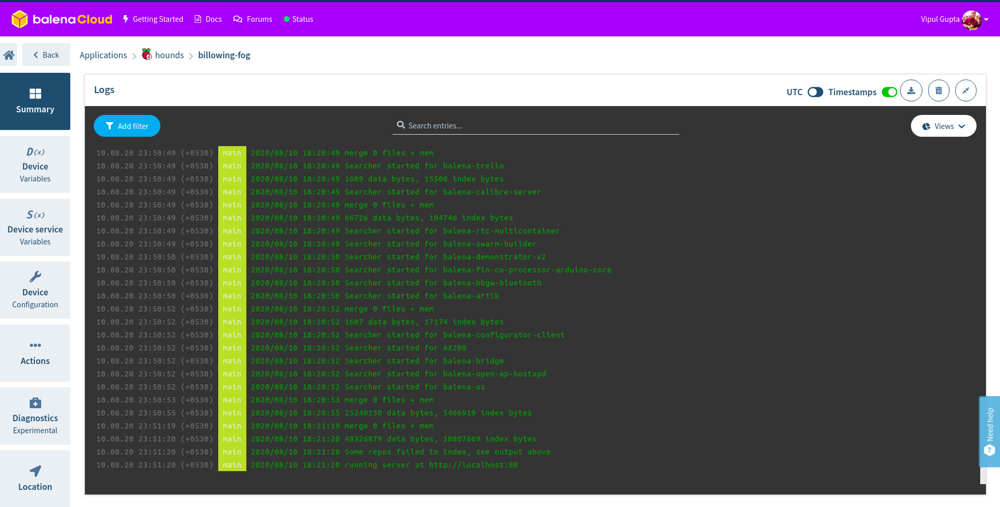

# Balena-Hound

> Run your personal hound instance over on balenaCloud with auto-indexing repositories 

## What is Hound?

[Hound](https://github.com/hound-search/hound) is an extremely fast source code search engine. The core is based on this article (and code) from Russ Cox: [Regular Expression Matching with a Trigram Index](http://swtch.com/~rsc/regexp/regexp4.html. Hound itself is a static [React](http://facebook.github.io/react/) frontend that talks to a [Go](http://golang.org/) backend. The backend keeps an up-to-date index for each repository and answers searches through a minimal API.

Source code for Hound, backend and frontend code is [here](https://github.com/hound-search/hound) along detailed deployment instructions.

## What new are we added/adding? 
1. Respositories names as seperate search results for more granular results (in pipeline) 
2. Deploy over RaspberryPi's, balenaFin, NUC - whatever IoT device you like for your personal hound instance accessible only to you. Bring on the private stuff. 
3. Auto-indexing repositories manually with a Python script at the moment ([Credit](https://eklitzke.org/indexing-git-repos-with-hound))  
   
As much as I like Python, I am not a big fan of installing Python in a golang docker base image to bloat it up all for a single script. So, I am writing a alternative Golang executable for the same script which will be run as a Cron job inside the container every day. So effectively Cron will run the indexing script to create a config.json every day. Once that is complete, we will delete the current config.json, kill and re-run houndd, let it index based of the previous data already available. Should be quicker, I hope.

## Let's talk deployment

0. Hit this button below to deploy balena-hound to balenaCloud (First 10 devices is free!)

[](https://dashboard.balena-cloud.com/deploy)

1. Clone the repository and change directory into it.

2. Open `confignator.py` to edit the default settings & organisation usernames for indexing. 

```
DEFAULT_SETTINGS = {
    "max-concurrent-indexers": 4, 
    "dbpath": "data", 
    "title" : "Hound",
    "health-check-uri" : "/healthz",
}


usernames = [
        "balena-io",
        "balena-io-library",
        "balenalabs",
        "product-os",
        "people-os",
        "company-os",
        "balena-io-playground",
]    
```

3. Run `confignator.py` (Can be run only once per hour, GitHub API rate limits.)

```
python3 confignator.py
```

3. When a config.json with all URLs is created, then create a new release. 

```
balena push balena-hound
```

4. Provision the device on `balena-hound`, let it index the repos (Takes time) and it will be ready with message in the console. 

```
running server at http://localhost:80
```



## If you are new to balenaCloud

[Get started!](https://www.balena.io/docs/learn/getting-started/raspberrypi3/nodejs/)
